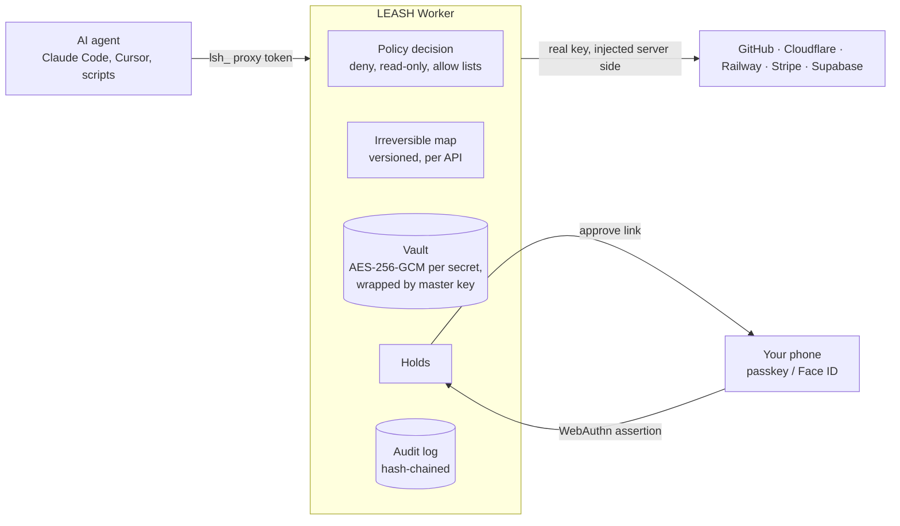
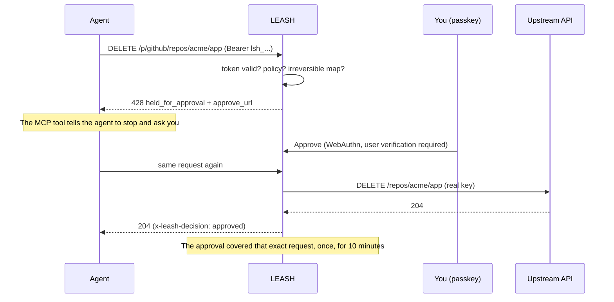

<div align="center">

# LEASH

### Agents get tokens. Not the keys.

**The credential broker for AI agents.** Your coding agent gets scoped, expiring proxy tokens instead of your real API keys,
and anything it can't take back (deleting a database, force pushing `main`, refunding customers, `DROP TABLE`) is **held**
until a human approves it with a passkey.

[Website](https://leash.gautamkhosla.com) · [Quickstart](#quickstart) · [How it works](#how-it-works) · [Security](SECURITY.md) · [Threat model](docs/THREAT_MODEL.md) · [Policy reference](docs/POLICY.md)

</div>

---

## Why this exists

On **25 April 2026**, a Cursor agent working on a staging credential mismatch searched a repo, found a Railway API token in
an unrelated file, and called `volumeDelete`. PocketOS lost its production database **and every volume backup in nine
seconds**. The token had been created to manage custom domains. Every prompt-level guardrail was switched on.
([AI Incident Database](https://incidentdatabase.ai/reports/7311), [PointGuard AI](https://pointguardai.com/ai-security-incidents/ai-agent-deletes-production-database-in-nine-seconds-and-apologizes))

Prompts are not a permission system. LEASH moves the decision out of the model:

| Without LEASH | With LEASH |
|---|---|
| Real keys sit in `.env` files the agent can read | The agent only ever holds `lsh_` proxy tokens |
| An over-scoped token can do anything its owner can | Each token is narrowed by a policy (paths, methods, read-only, rate) |
| Destructive calls happen at machine speed | Irreversible calls are held until you tap approve |
| "What did the agent do?" is a guess | Every call is in a hash-chained audit log |

## How it works



What happens to one request:



### The three rules

1. **The agent never holds a real key.** Keys are encrypted in the vault (a separate AES-256-GCM key per secret, wrapped by
   a master key; ciphertexts are bound to their row with AAD). No API returns a key. The plaintext exists only inside the
   proxy for the length of one upstream call.
2. **Irreversible means held.** The [irreversible map](server/src/providers.js) lists the calls on each API that can't be
   undone, each with the reason. Held calls get a `428` with an approve link. Approval needs a fresh passkey ceremony and
   covers the exact same request (method, host, path, query, body hash) once, within 10 minutes.
3. **Everything is on the record.** Every write, hold, approval and denial is appended to a per-account log where each
   entry hashes the previous one. `GET /v1/audit/verify` recomputes the chain.

### The one dangerous switch

Some teams want an agent to run certain irreversible calls unattended (for example deleting preview branches). A token can
carry `unattendedIrreversible` rules, **but only a passkey holder can mint such a token**. A CLI session cannot, because an
agent running on the same laptop can read the CLI's config file. The same goes for approving holds.

## Quickstart

```bash
npx leashcli login                      # approve the code with your passkey in the browser
npx leashcli add github                 # paste the key once; it goes into the vault, never onto disk
npx leashcli creds                      # note the credential id
npx leashcli token <credentialId> --label "claude-code laptop"
```

### Claude Code (MCP)

```bash
claude mcp add leash -e LEASH_TOKENS=github=lsh_... -- npx -y leashcli mcp
```

The `leash_request` tool lets the agent call any configured API. When a call is held, the tool result tells the agent to
stop, give you the approve link, and retry the identical call after you approve.

### Any SDK or script

Point the base URL at LEASH and use the proxy token as the key:

| Provider | Base URL |
|---|---|
| GitHub | `https://leash.gautamkhosla.com/p/github` |
| Cloudflare | `https://leash.gautamkhosla.com/p/cloudflare` (paths after `/client/v4`) |
| Railway | `https://leash.gautamkhosla.com/p/railway/` (GraphQL) |
| Stripe | `https://leash.gautamkhosla.com/p/stripe` |
| Supabase (management API) | `https://leash.gautamkhosla.com/p/supabase` |

```js
import { Octokit } from '@octokit/rest';
const gh = new Octokit({ auth: process.env.LEASH_TOKEN, baseUrl: 'https://leash.gautamkhosla.com/p/github' });
```

### Watch holds from the terminal

```bash
npx leashcli watch      # prints each held call with its approve link and rings the bell
```

## Policies

A token can only narrow what its key can do. Full reference: [docs/POLICY.md](docs/POLICY.md).

```json
{
  "allow": [{ "method": "GET", "path": "/repos/acme/**" }, { "method": "POST", "path": "/repos/acme/*/issues" }],
  "deny": [{ "path": "/orgs/**" }],
  "hold": [{ "method": "POST", "path": "/repos/*/*/releases" }],
  "readOnly": false,
  "perMinute": 120
}
```

Order of evaluation: **deny, read-only, irreversible map, hold, allow list, default.**

## Repository layout

```
server/        Cloudflare Worker: API, proxy, vault, WebAuthn, policy, audit (no runtime dependencies)
  src/providers.js   the irreversible map (versioned; every rule has a test)
  test/              node:test suite with a virtual passkey authenticator and a fake upstream
  dev/local.js       full local server on node:sqlite
cli/           leash CLI and MCP server (zero dependencies)
site/public/   website and dashboard (strict CSP, Trusted Types, no third-party code)
docs/          threat model, policy reference, deployment, provider guides
```

## Develop

```bash
cd server
node --test test/*.test.js          # 14 tests: passkeys, phishing origins, holds, PocketOS replay, SQL, CSRF, IDOR, audit chain
node dev/local.js 8790              # http://localhost:8790 (passkeys work on localhost)
```

## Deploy

See [docs/DEPLOY.md](docs/DEPLOY.md). Short version: create the D1 database, set two secrets, apply the migration,
`wrangler deploy`.

## Status and roadmap

v1 brokers GitHub, Cloudflare, Railway, Stripe and Supabase. Next: Vercel, Fly.io, AWS (SigV4 re-signing), Neon,
PlanetScale; two-person approval; web push; SSO for teams; signed per-call receipts in the
[IETF SCITT](https://datatracker.ietf.org/wg/scitt/about/) shape.

LEASH follows the architecture of the IETF draft
[Credential Broker for Agents (CB4A)](https://www.ietf.org/archive/id/draft-hartman-credential-broker-4-agents-00.html):
policy decisions separated from credential delivery, short-lived scoped credentials, and approval tiers.

## License

Apache-2.0. See [LICENSE](LICENSE).
